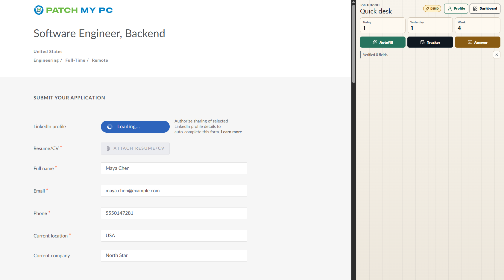
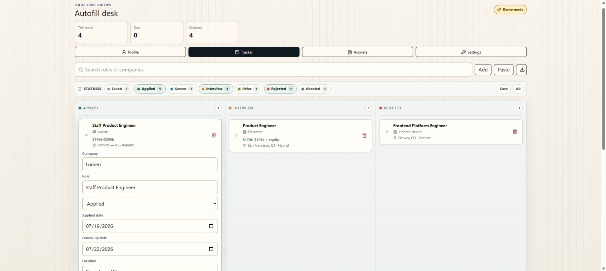

# Job Autofill + Tracker

一款本地优先的 Chrome 扩展，用于自动填写求职申请、根据个人资料草拟开放式筛选问题答案，以及跟踪申请进度。

## 截图

### 从侧面板自动填写在线申请



### 跟踪申请进度及跟进详情



## 功能特性

- 基于 WXT Manifest V3 扩展框架，包含后台 Worker、内容脚本、快捷侧面板和完整仪表盘页面。
- 基于确定性配置文件的字段映射，覆盖常见申请表单字段。
- 通过原生 setter 和 input/change/blur 事件实现 React 安全的输入框填充。
- 支持 Greenhouse、Lever、Ashby、LinkedIn、Indeed 和 Comeet 平台识别，并可通过点击触发填充。
- 支持 Upwork 提案抓取（从当前页面）、AI 解析（从粘贴的提案文本）、手动录入、提案经济指标及转化率统计。
- 提交后浮动提示，确认是否将检测到的申请保存到跟踪列表。
- 侧面板跟踪面板，支持手动录入跟踪记录或通过 AI 解析粘贴的职位信息。
- 混合薪酬跟踪：一个可见的薪酬字段，附带结构化的币种、范围和周期字段。
- 本地配置/设置存储在 `chrome.storage.local` 中。
- 申请记录和答案记忆通过 Dexie 存储在 IndexedDB 中。
- 可选自备 OpenAI API 密钥，用于批量 AI 生成开放式问题答案，并附带防捏造提示。
- 完整仪表盘：个人资料编辑器、看板/表格混合跟踪器、跟进日期、答案记忆视图、设置和 CSV 导出。
- 演示模式（截图安全），使用虚构的个人资料、跟踪记录和答案数据，不会覆盖真实本地记录。

## 隐私说明

该扩展采用本地优先架构。个人资料、设置、跟踪的申请记录和答案记忆均存储在您设备上的 Chrome 扩展存储和 IndexedDB 中。

AI 功能为可选启用，需要您自行提供 OpenAI API 密钥。启用后，扩展会将相关个人资料信息、职位描述文本、申请问题以及上传的简历文件数据发送给 OpenAI，以草拟答案或导入个人资料字段。API 密钥本地存储在 Chrome 扩展存储中。

跟踪的申请记录可能包含已提交申请表单上的问题和答案。在分享导出的 CSV 文件前，请仔细审查内容。

Upwork 页面抓取功能会在您跟踪或提交提案时读取可见的职位和提案表单，并打开本地草稿供您审查。它不会替您提交提案、搜索、刷新或导航 Upwork 页面。Upwork 可能限制未经授权的浏览器自动化操作；请仅在符合您的账户和 API 权限的前提下使用页面抓取功能。

## 权限说明

该扩展内置了以下求职网站的内容脚本匹配规则：

- Greenhouse
- Lever
- Ashby
- LinkedIn Jobs
- Indeed
- Comeet
- Upwork

此外，扩展请求了 `http://*/*` 和 `https://*/*` 的广泛主机权限，以及 `scripting` 权限，以便侧面板可以在当前活动标签页上执行用户触发的自动填充操作，包括自定义的 ATS 域名（如企业自建招聘门户）。注入的脚本会先检查页面是否看起来像求职申请页面，然后再执行操作。

扩展还请求访问 `https://api.openai.com/*` 以支持可选的 AI 功能。

## 快速启动

### 前置要求

- [Node.js](https://nodejs.org/)（推荐 v18 或更高版本）
- [npm](https://www.npmjs.com/)（通常随 Node.js 一同安装）

### 启动步骤

1. **安装依赖**

   ```powershell
   npm install
   ```

2. **编译 TypeScript 类型检查**

   ```powershell
   npm run compile
   ```

3. **启动开发模式**

   ```powershell
   npm run dev
   ```

4. **在 Chrome 中加载扩展**

   打开 Chrome 浏览器，访问 `chrome://extensions`，开启"开发者模式"，点击"加载已解压的扩展程序"，选择项目目录下的 `.output/chrome-mv3` 文件夹。

5. **构建生产版本（可选）**

   ```powershell
   npm run build
   ```

6. **打包为 .zip 文件（可选）**

   ```powershell
   npm run zip
   ```

## 安全说明

在发布版本前，请运行 `npm audit` 和 `npm audit --omit=dev` 检查依赖安全。依赖覆盖（overrides）仅用于修补有安全问题的过渡性开发依赖。

## 许可证

MIT