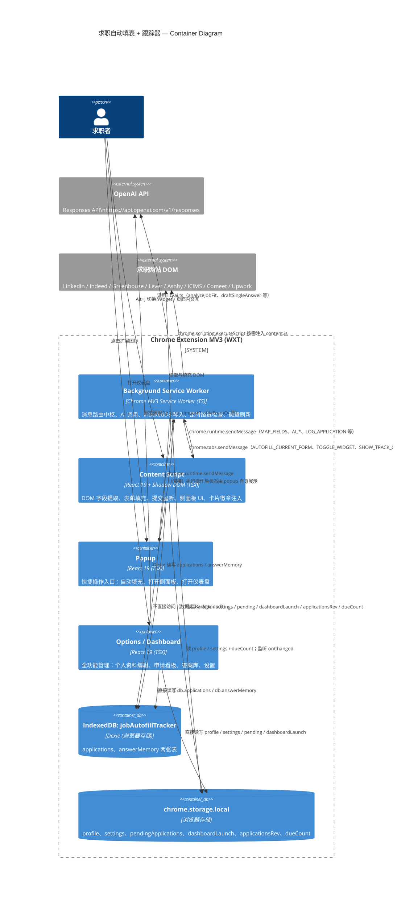

# 容器（Containers）

> 状态：**AS-IS**（反映当前代码实际行为，基于 `wxt.config.ts`、`entrypoints/background.ts`、`entrypoints/content/index.tsx`、`entrypoints/popup/main.tsx`、`entrypoints/options/main.tsx`、`lib/db.ts`、`lib/storage.ts`、`lib/ai.ts` 的实际实现）
>
> 这是 C4 模型的第 2 层（Container），描述扩展的运行单元、它们的职责、技术栈、数据访问与接口。系统整体上下文见 [system-context.md](system-context.md)，Content Script 内部细节见 [components/content-script.md](components/content-script.md)。

## 1. 概述

本扩展基于 **WXT 框架**构建，编译产物为标准 Chrome Extension **Manifest V3**。构建配置在 `wxt.config.ts` 中声明 manifest，输出到 `.output/chrome-mv3/`（生产）或 `.output/chrome-mv3-dev/`（开发）。

扩展包含 **4 个运行单元**（扩展代码）和 **3 个外部/存储单元**：

| # | 容器 | 类型 | 入口 |
|---|------|------|------|
| 1 | Background Service Worker | MV3 Service Worker | `entrypoints/background.ts` |
| 2 | Content Script | 注入页面 | `entrypoints/content/index.tsx` |
| 3 | Popup | 扩展弹出窗 | `entrypoints/popup/main.tsx` |
| 4 | Options / Dashboard | 扩展页面 | `entrypoints/options/main.tsx` |
| 5 | IndexedDB（Dexie） | 浏览器存储 | `lib/db.ts` |
| 6 | chrome.storage.local | 浏览器存储 | `lib/storage.ts` |
| 7 | OpenAI API | 外部系统 | `lib/ai.ts` |

## 2. Container Diagram

## 3. 容器详细说明

### 3.1 Background Service Worker

- **入口**：`entrypoints/background.ts`
- **技术**：Chrome MV3 Service Worker（TypeScript，经 WXT 编译为 `background.js`）
- **职责**：
  - **消息路由中枢**：通过 `chrome.runtime.onMessage` 接收并分发所有 `ExtensionMessage`（见 `lib/schema.ts` 的消息协议）。
  - **AI 调用入口（对 Content Script / Popup 而言）**：处理 `AI_JOB_FIT`、`AI_DRAFT_ANSWER`、`AI_DRAFT_APPLICATION`、`AI_ENRICH_PROFILE`，调用 `lib/ai.ts`。
  - **字段映射**：处理 `MAP_FIELDS`，执行三层填充优先级——`deterministicValue`（Profile 确定性匹配）→ `memoryValue`（记忆答案模糊匹配）→ 兜底返回（AI 不在 `MAP_FIELDS` 内执行，而是由前端 `directProfileFill` 与 `mergeFills` 合并）。
  - **数据持久化**：`LOG_APPLICATION`、`UPDATE_APPLICATION`、`DELETE_APPLICATION`、`LIST_APPLICATIONS`、`GET_TRACKED_JOB`、`REMEMBER_ANSWER` 通过 `lib/db.ts` 操作 IndexedDB。
  - **Pending 队列管理**：`QUEUE_PENDING_APPLICATION`、`REMOVE_PENDING_APPLICATION`、`APPLICATION_SUBMITTED`（来自页面提交事件）。
  - **定时跟进检查**：`chrome.alarms.create("dueCheck", { periodInMinutes: 60 })`，每小时刷新扩展图标徽章上的待办跟进数；`chrome.storage.onChanged` 监听 `applicationsRev` 与 `settings` 变化时也刷新。
  - **跨 Tab 消息转发**：`AUTOFILL_TAB`、`AUTOFILL_ACTIVE_TAB`、`OPEN_WIDGET_ACTIVE_TAB` 将请求转发到目标 Tab；若 Content Script 未注入，通过 `chrome.scripting.executeScript` 按需注入 `content-scripts/content.js` 后重试。
  - **Dashboard 启动**：`OPEN_DASHBOARD` 写入 `dashboardLaunch` 后打开 `options.html`。
- **数据访问**：
  - IndexedDB（通过 `lib/db.ts` 的 Dexie 实例）
  - `chrome.storage.local`（通过 `lib/storage.ts`：`getProfile`、`getSettings`、`queuePendingApplication`、`removePendingApplication`、`bumpApplicationsRev`、`setDueCount`、`setDashboardLaunch`）
- **接口**：`chrome.runtime.onMessage`（接收）；`chrome.tabs.sendMessage`（转发到 Content Script）；`chrome.scripting.executeScript`（注入）；`chrome.alarms` / `chrome.action`（徽章）
- **依赖**：`lib/ai.ts`、`lib/db.ts`、`lib/storage.ts`、`lib/mapping.ts`、`lib/jobs.ts`、`lib/demo.ts`、`lib/schema.ts`
- **特殊行为**：
  - 点击扩展图标（`chrome.action.onClicked`）直接打开 `options.html`（Popup 仍会显示，因为 manifest 声明了 default_popup——AS-IS 行为以 Popup 优先）。
  - 快捷键命令 `toggle-widget`（`Alt+J`）向当前 Tab 发送 `TOGGLE_WIDGET`。

### 3.2 Content Script

- **入口**：`entrypoints/content/index.tsx`（WXT `defineContentScript`）
- **注入配置**（AS-IS）：
  - `matches: ["https://*/*", "http://*/*"]`——在所有页面注入
  - `allFrames: true`——所有 iframe 也注入（用于嵌入 ATS 表单的 iframe）
  - `runAt: "document_idle"`
  - `cssInjectionMode: "ui"`——CSS 通过 Shadow DOM UI 注入，不污染宿主页面
- **激活门控**：`isAllowedJobPage()` 判断是否在已知求职网站或检测到申请表面征（`hasApplicationSurface()`）。非求职页面仅隐藏 FAB，但 Widget 仍可被 Popup 显式唤起。
- **技术**：React 19（通过 `@wxt-dev/module-react`）+ Shadow DOM（`createShadowRootUi`）
- **职责**：
  - **DOM 字段提取与填充**：`lib/engine.ts`（位于 `entrypoints/content/`）的 `extractFields()`、`fillCurrentForm()`，两遍填充策略（第一遍 → 等待 200ms 动态字段 → 第二遍）。
  - **提交监听**：`watchSubmit()` 监听 click/submit 事件，识别最终提交控件后触发 `queueTrackCurrentApplication()`。
  - **侧面板 UI**：`Widget.tsx` 渲染在 Shadow DOM 中，提供 6 个 Tab（match / autofill / answer / upwork / tracker / profile）。
  - **卡片徽章注入**：`cardBadges.ts` 在 LinkedIn / Indeed 搜索页面的职位卡片上注入技能匹配分数徽章（注入到宿主页面 DOM，非 Shadow DOM）。
- **数据访问**：
  - **不直接访问 IndexedDB**——所有申请数据通过 `chrome.runtime.sendMessage` 走 Background。
  - 直接读 `chrome.storage.local`（`getProfile`、`getSettings`、`getDueCount`），并监听 `chrome.storage.onChanged` 刷新 UI（`profile`、`settings`、`dueCount`）。
- **接口**（`chrome.runtime.onMessage`，接收）：
  - `AUTOFILL_CURRENT_FORM`——执行 `fillCurrentForm()` 并返回填充审查结果
  - `TRACK_CURRENT_APPLICATION`——执行 `queueTrackCurrentApplication()` 返回 pending
  - `TOGGLE_WIDGET`——切换 Widget 开关
  - `SHOW_TRACK_CONFIRM`——展示提交确认弹窗（`TrackConfirm` 组件）
- **依赖**：`lib/fillers.ts`、`lib/engine.ts`（本地 `entrypoints/content/engine.ts`）、`lib/affinity.ts`、`lib/storage.ts`、`lib/jobs.ts`、`lib/profileValues.ts`、`lib/schema.ts`、`lib/upwork.ts`、`lib/ai.ts`（仅类型）
- **内部组件**：详见 [components/content-script.md](components/content-script.md)

### 3.3 Popup

- **入口**：`entrypoints/popup/main.tsx`
- **技术**：React 19（`lucide-react` 图标）
- **职责**：快捷操作入口，提供三个按钮：
  - **自动填充当前页面**——发送 `AUTOFILL_ACTIVE_TAB`，显示填充数与待检查数。
  - **打开侧面板**——发送 `OPEN_WIDGET_ACTIVE_TAB`（唤起当前 Tab 的 Widget），成功后关闭 Popup。
  - **跟踪仪表盘**——发送 `OPEN_DASHBOARD`，成功后关闭 Popup。
- **数据访问**：仅 `getSettings()`（读取主题应用到 `document.documentElement.dataset.theme`）；其余操作全走 Background。
- **接口**：`chrome.runtime.sendMessage` 与 Background 通信
- **依赖**：`lib/storage.ts`、`lib/schema.ts`

### 3.4 Options / Dashboard

- **入口**：`entrypoints/options/main.tsx`（HTML：`entrypoints/options/index.html`）
- **技术**：React 19（`lucide-react` 图标，Tailwind CSS）
- **职责**：全功能管理界面，4 个 Tab：
  - **个人资料（profile）**——Profile 全字段编辑、简历 PDF 导入（`importProfileFromCv`）、求职信存储、AI 智能添加（`enrichProfileFromText`）、技能/经验/项目编辑器。
  - **跟踪器（tracker）**——申请看板（Kanban，拖拽改状态）、手动添加、AI 粘贴创建（`draftApplicationFromJobPosting`）、Pending 申请处理、Upwork 统计、CSV 导出（`chrome.downloads.download`）。
  - **答案（memory）**——答案库 CRUD，支持 AI 草拟（`draftSingleAnswer`）。
  - **设置（settings）**——演示模式开关、主题、跟踪录入方式、API Key、模型、卡片徽章开关、启用站点。
- **数据访问**（关键差异）：
  - **直接访问 Dexie（IndexedDB）**：`db.applications.add/update/delete`、`db.answerMemory.add/update/delete`、`db.applications.orderBy("dateApplied")`、`db.answerMemory.where("questionHash")`。**不经过 Background**。
  - **直接读写 `chrome.storage.local`**：`saveProfile`、`saveSettings`、`getProfile`、`getSettings`、`getPendingApplications`、`removePendingApplication`、`getDashboardLaunch`、`clearDashboardLaunch`、`bumpApplicationsRev`。
  - **直接调用 `lib/ai.ts`**：`importProfileFromCv`、`draftApplicationFromJobPosting`、`draftSingleAnswer`、`enrichProfileFromText`（AS-IS，未走消息路由）。
- **跨上下文同步**：监听 `chrome.storage.onChanged`，响应 `pendingApplications`、`dashboardLaunch`、`settings`、`applicationsRev` 变化刷新视图。
- **Dashboard 启动协议**：Background 写入 `dashboardLaunch`（`{ tab, pendingId?, applicationId?, createdAt }`）后打开页面，Options 启动时 `consumeDashboardLaunch()` 读取并清除，自动跳转到对应 Tab 并定位申请/ pending。
- **依赖**：`lib/db.ts`、`lib/storage.ts`、`lib/ai.ts`、`lib/compensation.ts`、`lib/demo.ts`、`lib/mapping.ts`、`lib/theme.ts`、`lib/upwork.ts`、`lib/schema.ts`

> **AS-IS 注记**：Options 直接访问 Dexie 与 `lib/ai.ts`，与 [AGENTS.md](../AGENTS.md) Global Invariant #2"Background 是唯一 AI 调用入口"存在偏差。该约束实际仅对 Content Script / Popup 成立。修改时需注意：Options 的 AI 调用绕过了 Background 的统一错误处理，且 Demo Mode 的短路逻辑分散在 Options 各处。

### 3.5 IndexedDB（通过 Dexie）

- **封装**：`lib/db.ts`（`JobTrackerDb extends Dexie`）
- **数据库名**：`jobAutofillTracker`
- **Schema 版本**：`version(1)`
- **表**：

| 表 | 主键 | 索引 | 用途 |
|----|------|------|------|
| `applications` | `++id`（自增） | `dateApplied`, `status`, `company`, `role`, `nextActionDate` | 申请记录 |
| `answerMemory` | `++id`（自增） | `questionHash`, `lastUsed` | 记忆的筛选问题答案 |

- **访问者**：Background（经 `lib/db.ts`）、Options（经 `lib/db.ts`，直接）。**Content Script 不直接访问**。
- **跨上下文同步信号**：Dexie 的变更事件无法到达 Content Script，因此每次 `applications` 表变更后必须调用 `bumpApplicationsRev()`（写入 `chrome.storage.local.applicationsRev`），Widget 与 Options 通过 `chrome.storage.onChanged` 监听此计数器刷新。

### 3.6 chrome.storage.local

- **封装**：`lib/storage.ts`
- **键**：

| 键 | 类型 | 用途 | 写入者 |
|----|------|------|--------|
| `profile` | `Profile` | 主个人资料（含简历/求职信文件 dataUrl） | Options（`saveProfile`） |
| `settings` | `Settings` | 设置（apiKey、model、demoMode、theme、trackingEntryMode、cardBadges、enabledSites、provider） | Options（`saveSettings`） |
| `pendingApplications` | `PendingApplication[]` | 提交检测到的待确认申请队列 | Background（`queuePendingApplication` / `removePendingApplication`） |
| `dashboardLaunch` | `DashboardLaunch` | 打开 Dashboard 时的跳转指令 | Background（`setDashboardLaunch`）、Options（`clearDashboardLaunch`） |
| `applicationsRev` | `number` | applications 表变更计数器（跨上下文同步信号） | Background / Options（`bumpApplicationsRev`） |
| `dueCount` | `number` | 当前到期跟进数 | Background（`setDueCount`） |

- **Demo Mode 短路**：`getProfile()` 在 `settings.demoMode === true` 时返回 `structuredClone(DEMO_PROFILE)`，`saveProfile` 抛错，`queuePendingApplication` / `removePendingApplication` 跳过。

### 3.7 OpenAI API

- **端点**：`https://api.openai.com/v1/responses`（Responses API）
- **封装**：`lib/ai.ts` 的 `createOpenAiJson()`（统一请求构造与错误处理）
- **请求格式**：JSON Schema 严格模式（`text.format.type = "json_schema"`，`strict: true`），`model` 与 `apiKey` 来自 `settings`
- **认证**：`Authorization: Bearer ${settings.apiKey}`
- **用途**（5 类 AI 能力）：
  - `importProfileFromCv`——简历 PDF 导入为 Profile（Options 专用）
  - `enrichProfileFromText`——从自由文本富化个人资料（Options 与 Content Script 的 ProfileTab）
  - `draftSingleAnswer`——草拟单个筛选问题答案（Content Script AnswerTab、Options MemoryPanel）
  - `draftApplicationFromJobPosting`——从职位文本提取 Application 草稿（Content Script 跟踪表单、Options 粘贴创建）
  - `analyzeJobFit`——职位匹配深度分析（Content Script MatchTab）
- **调用入口**：
  - Background 路由：Content Script / Popup 通过 `chrome.runtime.sendMessage` 发送 `AI_*` 消息，Background 调用 `lib/ai.ts`。
  - Options 直接调用：`import` `lib/ai.ts` 函数（AS-IS 偏差，见 3.4）。
- **Manifest 配置**：`host_permissions` 包含 `https://api.openai.com/*`。

## 4. 运行单元边界速查表

| 调用方向 | 通信机制 | 备注 |
|----------|----------|------|
| Popup / Content Script → Background | `chrome.runtime.sendMessage` | 异步，返回 Promise |
| Background → Content Script | `chrome.tabs.sendMessage` | 按需 `executeScript` 注入后重试 |
| Content Script → 宿主页面 DOM | 直接 DOM API | Shadow DOM 隔离 UI；卡片徽章注入宿主 DOM |
| Options → IndexedDB / storage / AI | 直接 `import` | 不经 Background |
| 跨上下文数据同步 | `chrome.storage.onChanged` + `applicationsRev` | Dexie 事件不可达 Content Script |
| Background → 扩展图标徽章 | `chrome.action.setBadgeText` | 显示到期跟进数 |

## 5. 构建产物（参考）

依据 `.output/chrome-mv3/`（AS-IS）：

- `background.js`——Background Service Worker
- `content-scripts/content.js` + `content.css`——Content Script
- `popup.html` + 对应 JS——Popup
- `options.html` + 对应 JS——Options
- `manifest.json`——MV3 清单
- `chunks/`——共享代码分块

## 6. 相关文档

| 主题 | 文档 |
|------|------|
| 系统整体上下文 | [system-context.md](system-context.md) |
| Content Script 内部组件 | [components/content-script.md](components/content-script.md) |
| 自动填充链路 | [flows/autofill.md](flows/autofill.md) |
| 申请跟踪链路 | [flows/application-tracking.md](flows/application-tracking.md) |
| 消息协议与数据契约 | [contracts/message-protocol.md](contracts/message-protocol.md) |
| 数据模型 | [contracts/data-model.md](contracts/data-model.md) |
| 运行与验证命令 | [operations/dev-setup.md](operations/dev-setup.md) |
| 故障排查 | [operations/troubleshooting.md](operations/troubleshooting.md) |
| 术语表 | [glossary.md](glossary.md) |
