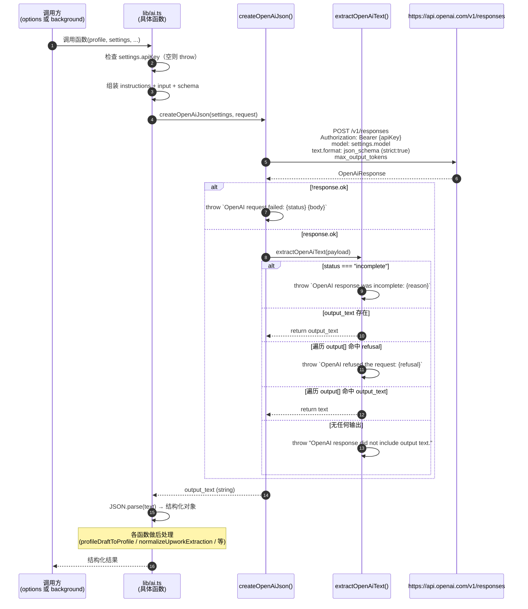
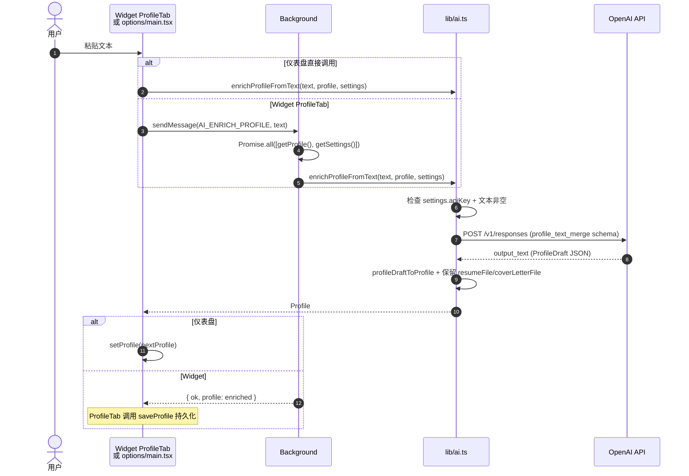
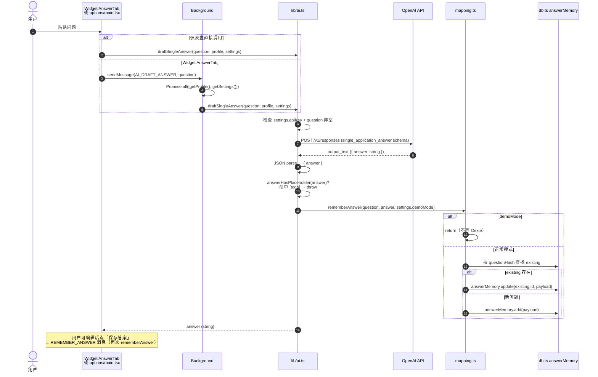
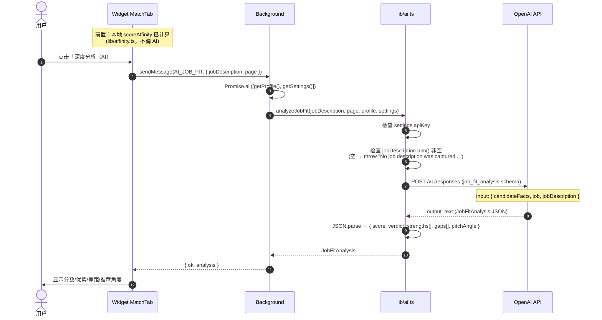
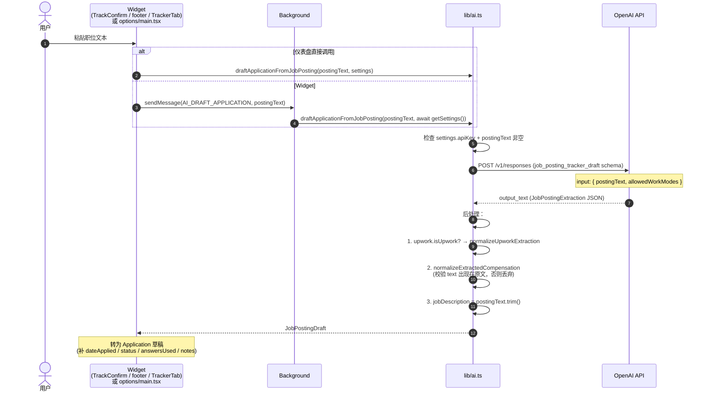

# AI 集成业务链路（AS-IS）

本文档描述所有 OpenAI API 调用的流程。扩展共 5 个 AI 功能，全部由 `lib/ai.ts` 实现，统一通过 `createOpenAiJson()` 发送到 OpenAI Responses API。所有引用的文件路径与函数名均对应仓库当前实现。

## 一、5 个 AI 功能概览

| # | 功能 | 入口函数（`lib/ai.ts`） | Schema 名 | maxOutputTokens | 调用方式 |
| --- | --- | --- | --- | --- | --- |
| 1 | 简历导入 | `importProfileFromCv` | `cv_profile_import` | 3000 | 仪表盘**直接调用** |
| 2 | 资料富化 | `enrichProfileFromText` | `profile_text_merge` | 4000 | 仪表盘直接调用 / Widget `AI_ENRICH_PROFILE` 消息 |
| 3 | 答案草拟 | `draftSingleAnswer` | `single_application_answer` | 700 | 仪表盘直接调用 / Widget `AI_DRAFT_ANSWER` 消息 |
| 4 | 职位匹配分析 | `analyzeJobFit` | `job_fit_analysis` | 1200 | 仅 Widget `AI_JOB_FIT` 消息 |
| 5 | 职位信息提取 | `draftApplicationFromJobPosting` | `job_posting_tracker_draft` | 2200 | 仪表盘直接调用 / Widget `AI_DRAFT_APPLICATION` 消息 |

### 调用方式说明

**两种调用路径并存**：

1. **仪表盘（Options 页）直接调用**：`entrypoints/options/main.tsx` 直接 `import { ... } from "../../lib/ai"`，因为是扩展页面（`options.html`），与 `lib/ai.ts` 同处一个模块图，可直接调用并 `await`。涉及 `importProfileFromCv`、`enrichProfileFromText`、`draftSingleAnswer`、`draftApplicationFromJobPosting`。

2. **内容脚本（Widget）经 Background 中转**：Content Script（`entrypoints/content/Widget.tsx`、`ProfileTab.tsx`、`TrackerTab.tsx`）通过 `chrome.runtime.sendMessage` 发送 AI 消息到 Background（`entrypoints/background.ts`），Background 调用 `lib/ai.ts` 对应函数后返回结果。Background 在调用前会先 `await getProfile()` 和 `await getSettings()` 组装参数。涉及 `AI_ENRICH_PROFILE`、`AI_DRAFT_ANSWER`、`AI_JOB_FIT`、`AI_DRAFT_APPLICATION`。

注意：`importProfileFromCv` 是唯一**没有对应 Background 消息处理**的 AI 函数（仅仪表盘可用，因需读取本地 PDF 文件并上传）。

## 二、共同调用模式

所有 5 个函数内部均调用 `createOpenAiJson(settings, request)`，该私有函数（`lib/ai.ts`）封装了统一的请求逻辑：



### 请求体结构（createOpenAiJson）

```jsonc
{
  "model": "settings.model",            // 默认 "gpt-5.4-mini"
  "input": [
    { "role": "developer", "content": "instructions" },
    ...request.input                    // 用户消息（含 JSON.stringify 的 facts）
  ],
  "text": {
    "format": {
      "type": "json_schema",
      "name": "<schemaName>",
      "strict": true,                   // 严格模式
      "schema": { ... }                 // additionalProperties: false 全程约束
    }
  },
  "max_output_tokens": "<maxOutputTokens>"
}
```

所有 schema 均设置 `additionalProperties: false` + 显式 `required`，强制模型只返回 schema 内字段。`importProfileFromCv` 的 `input` 使用多模态 `content` 数组（`input_text` + `input_file`，后者携带 `filename` 与 `file_data` data URL）。

## 三、各功能详细流程

### 1. 简历导入（importProfileFromCv）

```mermaid
sequenceDiagram
    autonumber
    actor U as 用户
    participant OPT as options/main.tsx
    participant AI as lib/ai.ts
    participant API as OpenAI Responses API
    participant ST as storage.ts

    U->>OPT: 选择 PDF 简历文件
    OPT->>OPT: readFileDataUrl(file) → dataUrl
    OPT->>AI: importProfileFromCv(fileName, fileDataUrl, profile, settings)
    AI->>AI: 检查 settings.apiKey
    AI->>API: POST /v1/responses (input_file + input_text)
    API-->>AI: output_text (ProfileDraft JSON)
    AI->>AI: profileDraftToProfile(draft)<br/>合并 EMPTY_PROFILE + 规范化 phone
    AI-->>OPT: Profile
    OPT->>OPT: { ...draft, resumeFileRef: fileName, resumeFile: {name,type,dataUrl} }
    OPT->>ST: saveProfile(profileWithResume)
    Note over ST: demoMode → throw "Profile changes cannot be saved..."
```

**特点**：
- 唯一使用 `input_file` 多模态输入的 AI 函数。
- 指令要求：仅提取 CV 中存在的事实，保留现有 profile 值，不推断 demographics/applicationDefaults。
- `profileDraftToProfile` 将 AI 返回的 `skills` 数组转为 `Record<string, SkillFact>`，并 `normalizeProfilePhone`。
- 仪表盘拿到结果后附加 `resumeFile`（含 dataUrl）并 `saveProfile`。

### 2. 资料富化（enrichProfileFromText）



**特点**：
- 指令要求：合并而非替换，保留现有事实，不推断 demographics/授权/薪资/日期等，去重 experience/projects/skills。
- 返回时显式保留 `currentProfile.resumeFile` 与 `coverLetterFile`（AI 不应触及这俩字段）。
- 消息处理：`background.ts` 的 `AI_ENRICH_PROFILE` 分支用 `Promise.all` 并行取 profile + settings。

### 3. 答案草拟（draftSingleAnswer）



**特点**：
- 指令（`naturalAnswerInstructions`）：第一人称、2-5 短句、<90 词、避免套话/占位符/虚构事实。
- **自动记忆**：草拟成功后立即调用 `rememberAnswer`，按 `questionHash`（DJB2 哈希，`mapping.ts`）upsert。重复问题会更新而非新建（幂等性）。
- **placeholder 检测**：`answerHasPlaceholder`（正则 `/\[\s*todo\b|\btodo\s*:/i`）命中则 throw，避免存入无价值答案。
- Demo Mode：`rememberAnswer` 内 `if (demoMode) return`，不写 Dexie；但 AI 调用本身仍执行（仪表盘在 demo 下会构造临时 memory 对象加入内存列表）。

### 4. 职位匹配分析（analyzeJobFit）



**特点**：
- 唯一**仅通过消息调用**（无仪表盘直接调用入口）的 AI 函数。
- 输入 `candidateFacts` 由 `profileFactsForAi(profile)` 生成（剥离 `resumeFile`/`coverLetterFile`）。
- 指令要求：0-100 评分，verdict 一句话，仅引用 candidateFacts 中存在的事实，不虚构。
- 前置依赖：Widget 的 `MatchTab` 先用本地 `scoreAffinity`（`lib/affinity.ts`，无 AI）给出即时分数，AI 深度分析为可选增强。

### 5. 职位信息提取（draftApplicationFromJobPosting）



**特点**：
- 唯一不依赖 Profile 的 AI 函数（仅用 `postingText` + `settings`）。
- 指令明确：不使用/推断当前浏览器页面信息，仅用粘贴文本；Upwork 内容设 `isUpwork=true`；非 Upwork 设空 upwork 字段。
- `normalizeExtractedCompensation`（`lib/ai.ts`）：若 `compensation.text` 规范化后不出现在 `postingText` 中，则整体丢弃返回 `undefined`（防止 AI 编造薪资）。
- Upwork 提取后用 `normalizeUpworkExtraction` 清理（空字符串日期转 `undefined`）。

## 四、关键设计点

### API Key 前置检查

所有 5 个 AI 函数**首先**检查 `settings.apiKey`：

```ts
if (!settings.apiKey) throw new Error("OpenAI API key is required before ...");
```

错误消息因功能而异（"importing a CV" / "adding profile facts" / "drafting an answer" / "analyzing job fit" / "parsing a job posting"）。该检查在 `createOpenAiJson` 之前执行，避免无 key 时发起网络请求。

`draftSingleAnswer` 与 `enrichProfileFromText` 还额外检查输入非空（`question.trim()` / `pastedText.trim()`），`analyzeJobFit` 检查 `jobDescription.trim()`，`draftApplicationFromJobPosting` 检查 `postingText.trim()`。

### 错误处理层次

1. **API Key 缺失**：函数入口同步 throw。
2. **输入为空**：函数入口同步 throw。
3. **HTTP 错误**：`createOpenAiJson` 中 `if (!response.ok) throw new Error(`OpenAI request failed: ${response.status} ${await response.text()}`)` —— 包含状态码与响应体。
4. **响应不完整**：`extractOpenAiText` 中 `payload.status === "incomplete"` → throw `OpenAI response was incomplete: ${reason}`。
5. **模型拒绝**：遍历 `output[].content[]`，命中 `type === "refusal"` → throw `OpenAI refused the request: ${refusal}`。
6. **无输出文本**：遍历完毕未找到 `output_text` → throw `OpenAI response did not include output text.`。
7. **答案 placeholder**：仅 `draftSingleAnswer`，`answerHasPlaceholder` 命中 → throw `AI returned a placeholder instead of a usable answer.`。

所有错误经 Background 的 `handleMessage().catch()` 包装为 `{ ok: false, error: detail }` 返回调用方（仪表盘直接调用则 throw 冒泡到调用处的 try/catch）。

### Demo Mode 影响

AI 功能在 Demo Mode 下**仍可使用**（不阻塞 API 调用），但持久化层被跳过：

| 函数 | Demo Mode 行为 |
| --- | --- |
| `importProfileFromCv` | AI 正常调用；但 `saveProfile` 会 throw "Profile changes cannot be saved while demo mode is active."（`storage.ts`） |
| `enrichProfileFromText` | AI 正常调用；`saveProfile` 同上 |
| `draftSingleAnswer` | AI 正常调用；`rememberAnswer` 内 `if (demoMode) return`，**不写 Dexie** |
| `analyzeJobFit` | AI 正常调用；无持久化副作用 |
| `draftApplicationFromJobPosting` | AI 正常调用；后续 `LOG_APPLICATION` 在 demoMode 下 Background 直接 `return { ok: true }` 不写 Dexie |

仪表盘（`options/main.tsx`）在 demo 模式下会构造临时内存对象（如临时 `AnswerMemory` 加入 `memories` state，临时 `Application` 用 `Math.max(...ids)+1` 模拟 id），让用户预览效果而不持久化。

### 幂等性

- **答案草拟**：`draftSingleAnswer` 自动 `rememberAnswer`，按 `questionHash`（`mapping.ts`，DJB2 算法）upsert。同一问题多次草拟会**更新**现有记录而非新建（`existing?.id` 命中走 `update`，否则 `add`）。
- **其他 AI 函数**：无持久化副作用（`importProfileFromCv`/`enrichProfileFromText` 由调用方决定是否 `saveProfile`；`analyzeJobFit`/`draftApplicationFromJobPosting` 纯读取），天然幂等。
- **`rememberAnswer` 单独消息**：Widget AnswerTab 的「保存答案」按钮发送 `REMEMBER_ANSWER` 消息，Background 调用 `rememberAnswer(question, answer, demoMode)`，同样按 `questionHash` upsert，可重复调用。

### profileFactsForAi

`lib/ai.ts` 的 `profileFactsForAi(profile)` 工具函数剥离 `resumeFile` 与 `coverLetterFile`（大二进制 dataUrl），只把结构化事实发送给 AI。被 `analyzeJobFit`、`draftSingleAnswer`、`enrichProfileFromText`、`importProfileFromCv` 共用。

### 模型与端点

- 端点：`POST https://api.openai.com/v1/responses`（Responses API，非 Chat Completions）。
- 模型：`settings.model`，默认 `"gpt-5.4-mini"`（`lib/schema.ts` 的 `DEFAULT_SETTINGS`）。
- 认证：`Authorization: Bearer ${settings.apiKey}`。
- 输出格式：强制 `json_schema` + `strict: true`。

## 五、消息处理对照表

| 消息类型 | Background 处理（`background.ts`） | 调用的 AI 函数 | 发送方 |
| --- | --- | --- | --- |
| `AI_DRAFT_APPLICATION` | `draftApplicationFromJobPosting(message.postingText, await getSettings())` | `draftApplicationFromJobPosting` | `Widget.tsx`（readPosting / TrackConfirm）、`TrackerTab.tsx` |
| `AI_ENRICH_PROFILE` | `Promise.all([getProfile(), getSettings()])` → `enrichProfileFromText(message.text, profile, settings)` | `enrichProfileFromText` | `ProfileTab.tsx` |
| `AI_DRAFT_ANSWER` | `Promise.all([getProfile(), getSettings()])` → `draftSingleAnswer(message.question, profile, settings)` | `draftSingleAnswer` | `Widget.tsx`（AnswerTab） |
| `AI_JOB_FIT` | `Promise.all([getProfile(), getSettings()])` → `analyzeJobFit(message.jobDescription, message.page, profile, settings)` | `analyzeJobFit` | `Widget.tsx`（MatchTab） |
| `REMEMBER_ANSWER` | `rememberAnswer(message.question, message.answer, (await getSettings()).demoMode)` | 无（直接操作 Dexie） | `Widget.tsx`（AnswerTab 保存按钮） |

`importProfileFromCv` 无对应消息，仅 `options/main.tsx` 直接调用。

## 相关文件

- `lib/ai.ts`：5 个 AI 函数 + `createOpenAiJson` + `extractOpenAiText` + `profileDraftToProfile` + `normalizeUpworkExtraction` + `normalizeExtractedCompensation` + `profileFactsForAi`
- `lib/mapping.ts`：`rememberAnswer`、`questionHash`、`answerHasPlaceholder`
- `lib/storage.ts`：`getProfile`、`getSettings`、`saveProfile`
- `lib/db.ts`：Dexie `answerMemory` 表
- `lib/schema.ts`：`Profile`、`Settings`、`Application`、`Compensation`、`UpworkProposalDetails` 类型 + `DEFAULT_SETTINGS`
- `lib/compensation.ts`：`normalizeCompensationCurrency`（被 `draftApplicationFromJobPosting` 后处理调用）
- `lib/profileValues.ts`：`normalizeProfilePhone`（被 `profileDraftToProfile` 调用）
- `entrypoints/background.ts`：`AI_DRAFT_APPLICATION` / `AI_ENRICH_PROFILE` / `AI_DRAFT_ANSWER` / `AI_JOB_FIT` / `REMEMBER_ANSWER` 消息处理
- `entrypoints/options/main.tsx`：仪表盘直接调用 `importProfileFromCv` / `enrichProfileFromText` / `draftSingleAnswer` / `draftApplicationFromJobPosting`
- `entrypoints/content/Widget.tsx`：`MatchTab`（AI_JOB_FIT）、`AnswerTab`（AI_DRAFT_ANSWER + REMEMBER_ANSWER）、`readPosting`/`TrackConfirm`（AI_DRAFT_APPLICATION）
- `entrypoints/content/ProfileTab.tsx`：`AI_ENRICH_PROFILE`
- `entrypoints/content/TrackerTab.tsx`：`AI_DRAFT_APPLICATION`
