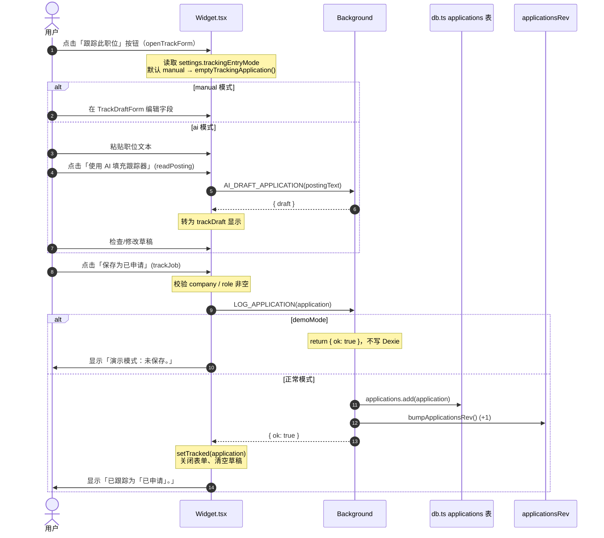

# 申请跟踪业务链路（AS-IS）

本文档描述从检测到申请提交到跟踪记录创建的完整流程，以及手动添加、AI 粘贴添加两条辅助流程。所有引用的文件路径与函数名均对应仓库当前实现。

## 一、自动检测提交流程

### 触发条件

`entrypoints/content/index.tsx` 在 `isAllowedJobPage()` 且非 `isTopPageWithEmbeddedJobForm()` 的帧中调用 `watchSubmit()`（`entrypoints/content/engine.ts`）。`watchSubmit` 注册两个捕获阶段的事件监听：

1. **click**（`capture: true`）：目标 `closest("button, input[type=submit]")`，经 `isFinalSubmitControl` 判定为终态提交按钮。
2. **submit**（`capture: true`）：表单经 `formMatchesApplication` 判定为申请表单。

`isFinalSubmitControl` 排除中间步骤按钮（文本含 `next / continue / review / easy apply / apply now / start application`），仅保留 `submit / send` 或 `submit application / submit your application / send application`。

`formMatchesApplication` 要求表单含 ≥3 个字段，且文本含 `application / resume / cover letter / linkedin / phone / email` 之一。

命中后调用 `requestTrackCurrentApplication()` → `queueTrackCurrentApplication()`。

### 完整流程（Mermaid 时序图）

```mermaid
sequenceDiagram
    autonumber
    actor U as 用户
    participant DOM as 页面 DOM
    participant CS as Content Script<br/>(engine.ts)
    participant BG as Background<br/>(background.ts)
    participant ST as storage.ts<br/>pendingApplications
    participant W as Widget.tsx<br/>TrackConfirm
    participant DB as db.ts<br/>applications 表
    participant SIG as applicationsRev 计数器

    U->>DOM: 点击提交按钮 / 提交表单
    DOM->>CS: watchSubmit 捕获 click/submit
    CS->>CS: isFinalSubmitControl / formMatchesApplication

    Note over CS: queueTrackCurrentApplication()
    CS->>CS: buildCurrentApplication("Applied")
    Note over CS: 从 getPageContext / extractJobLocation /<br/>detectWorkMode / extractJobDescription /<br/>extractFields(answersUsed) 构建

    Note over CS: 去重 key = source|company|role|canonicalJobUrl
    CS->>CS: loggedSubmissionKeys.has(key)?

    alt 已记录（同次会话已触发）
        Note over CS: 静默跳过（不发消息）
    else 新 key
        CS->>CS: loggedSubmissionKeys.add(key)
        CS->>BG: sendMessage(APPLICATION_SUBMITTED, pending)

        Note over BG: background.ts → APPLICATION_SUBMITTED
        BG->>ST: queuePendingApplication(pending)
        Note over ST: demoMode → 直接 return<br/>否则按 id 去重后写入<br/>chrome.storage.local

        BG->>CS: sendMessage(SHOW_TRACK_CONFIRM, pending)<br/>(回送到 sender.tab.id)
        CS->>W: setPendingConfirm(pending) + setOpen(true)

        Note over W: 显示 TrackConfirm 确认弹窗

        alt 用户选择「手动录入」
            U->>W: 在 TrackDraftForm 填写字段
            U->>W: 点击「保存为已申请」
            W->>BG: sendMessage(LOG_APPLICATION, application)
            Note over BG: demoMode → return { ok: true }<br/>否则 db.applications.add
            BG->>DB: applications.add(application)
            BG->>SIG: bumpApplicationsRev() (+1)
            BG-->>W: { ok: true }
            W->>BG: sendMessage(REMOVE_PENDING_APPLICATION, id)
            BG->>ST: removePendingApplication(id)
            W->>U: 显示「已保存到跟踪器」
        else 用户选择「AI 粘贴」
            U->>W: 粘贴职位文本
            U->>W: 点击「使用 AI 填充跟踪器」
            W->>BG: sendMessage(AI_DRAFT_APPLICATION, postingText)
            Note over BG: background.ts → AI_DRAFT_APPLICATION<br/>调用 lib/ai.ts draftApplicationFromJobPosting
            BG-->>W: { ok, draft: JobPostingDraft }
            Note over W: 转为 Application 草稿显示在 TrackDraftForm
            U->>W: 检查并修改草稿
            U->>W: 点击「保存为已申请」
            W->>BG: sendMessage(LOG_APPLICATION, application)
            BG->>DB: applications.add(application)
            BG->>SIG: bumpApplicationsRev() (+1)
            BG-->>W: { ok: true }
            W->>BG: sendMessage(REMOVE_PENDING_APPLICATION, id)
            BG->>ST: removePendingApplication(id)
            W->>U: 显示「已保存到跟踪器」
        else 用户选择「忽略」
            U->>W: 点击「忽略」
            W->>BG: sendMessage(REMOVE_PENDING_APPLICATION, id)
            BG->>ST: removePendingApplication(id)
            W->>U: 关闭弹窗
        end

        Note over SIG: chrome.storage.onChanged 触发<br/>所有上下文（Popup/Widget/Options）刷新
```

### PendingApplication 结构与去重

`PendingApplication`（`lib/schema.ts`）：
```ts
{
  id: string;            // = `${source}|${company}|${role}|${canonicalJobUrl(jobUrl)}`
  application: Application;
  createdAt: string;     // ISO
}
```

去重发生在**两个层级**：
1. **Content Script 内存层**：`loggedSubmissionKeys`（`engine.ts` 模块级 `Set<string>`）—— 同一 content script 实例内避免重复发送 `APPLICATION_SUBMITTED`。该 Set 不持久化，页面刷新后重置。
2. **Background 存储层**：`queuePendingApplication`（`storage.ts`）按 `id` 去重 —— `pendingApplications.some(item => item.id === pending.id)` 命中则不再写入。

## 二、手动添加流程（Widget 主动跟踪）

用户无需触发提交事件，可直接在 Widget 的 tracker 视图手动录入。



### 手动录入的初始空对象

`emptyTrackingApplication()`（`Widget.tsx`）：
```ts
{
  company: "", role: "", jobUrl: "", source: "Manual",
  dateApplied: new Date().toISOString(), status: "Applied",
  location: "", workMode: "", jobDescription: "",
  answersUsed: [], notes: ""
}
```

## 三、AI 粘贴添加流程（独立于提交检测）

Widget footer 提供 `TrackingModeSwitch`（manual / ai 切换）。AI 模式下：
1. 用户在 textarea 粘贴职位文本（`postingText`）。
2. 点击「使用 AI 填充跟踪器」→ `readPosting()` 发送 `AI_DRAFT_APPLICATION`。
3. Background 调用 `lib/ai.ts` 的 `draftApplicationFromJobPosting(postingText, settings)`，返回 `JobPostingDraft`。
4. Widget 将 draft 转为 `Application` 草稿（补 `dateApplied`、`status: "Applied"`、空 `answersUsed`、空 `notes`）。
5. 用户在 `TrackDraftForm` 检查并修改。
6. 点击「保存为已申请」→ `trackJob()` → `LOG_APPLICATION`。

注意：AI 模式下 Widget 明确不读取当前页面内容，仅使用用户粘贴的文本（UI 文案：「只有此粘贴的文本会发送给 AI。不会自动读取当前页面的任何内容。」）。

## 四、关键设计点

### 事务边界

Dexie（`lib/db.ts`）的 `applications` 表上每次操作都是**独立事务**：
- `db.applications.add(application)` —— `LOG_APPLICATION`
- `db.applications.update(id, patch)` —— `UPDATE_APPLICATION`
- `db.applications.delete(id)` —— `DELETE_APPLICATION`
- `db.applications.orderBy("dateApplied").reverse().toArray()` —— `LIST_APPLICATIONS`
- `db.applications.toArray()` —— `GET_TRACKED_JOB` 内部线性扫描

没有跨表或跨操作组合事务。`LOG_APPLICATION` 后紧跟 `REMOVE_PENDING_APPLICATION` 是两次独立消息，中间失败会留下 pending 残留（但 pending 仅用于弹窗提醒，不影响数据一致性）。

### Source of Truth

**Dexie `applications` 表**（IndexedDB `jobAutofillTracker` 数据库，`lib/db.ts`）是申请记录的唯一权威来源。索引：`++id, dateApplied, status, company, role, nextActionDate`。

辅助存储：
- `chrome.storage.local["pendingApplications"]`：待确认的提交事件队列（短暂存在，用户确认后移除）。
- `chrome.storage.local["dashboardLaunch"]`：打开仪表盘时的跳转上下文（`tab/pendingId/applicationId/createdAt`）。
- `chrome.storage.local["dueCount"]`：跟进待办计数（badge 显示用）。

### 同步信号：applicationsRev

由于 Dexie 的事件无法跨 content script 上下文传播，`lib/storage.ts` 的 `bumpApplicationsRev()` 在每次 `applications` 表变更后递增 `chrome.storage.local["applicationsRev"]` 计数器。

监听方：
- `background.ts`：`chrome.storage.onChanged` 监听 `applicationsRev` 或 `settings` 变化 → `refreshDueBadge()` 重算 badge。
- `entrypoints/content/Widget.tsx`：`onStorage` 监听 `profile / settings / dueCount`（注意：Widget 通过 `GET_TRACKED_JOB` 主动查询而非直接监听 `applicationsRev`）。
- Options 仪表盘：通过 `applicationsRev` 变化触发列表刷新。

### 去重：canonicalJobUrl

`lib/jobs.ts` 的 `canonicalJobUrl(url)` 用于规范化职位 URL 以便跨入口去重：
- 解析 URL，取 `hostname`。
- 提取 jobId：优先 `searchParams` 中的 `currentJobId`（LinkedIn）/ `jk`（Indeed）/ `jobKey`，其次 Upwork 路径中的 `~[0-9a-z]+` token，最后回退到 `pathname`。
- 返回 `${hostname}${jobId}`。

应用场景：
- `GET_TRACKED_JOB`：Background 用 `canonicalJobUrl(application.jobUrl) === canonicalJobUrl(message.url)` 线性扫描 `applications` 表，判断当前页是否已跟踪。
- `queueTrackCurrentApplication`：构建 pending.id 时包含 `canonicalJobUrl`，同一职位多次提交只产生一个 pending。

### Demo Mode 影响

`settings.demoMode`（`lib/schema.ts`）开启时：
- `LOG_APPLICATION` / `UPDATE_APPLICATION` / `DELETE_APPLICATION`：Background 直接 `return { ok: true }`，**不写 Dexie**。
- `LIST_APPLICATIONS`：返回 `createDemoApplications()`（`lib/demo.ts`），不读 Dexie。
- `GET_TRACKED_JOB`：返回 `{ ok: true, tracked: undefined }`，永远显示未跟踪。
- `queuePendingApplication` / `removePendingApplication`：`storage.ts` 内 `if (demoMode) return`，**不写 chrome.storage.local**。
- `refreshDueBadge`：基于 `createDemoApplications()` 计算 badge。
- Widget UI 仍显示「演示模式」徽章，操作返回「演示模式：未保存。」

### buildCurrentApplication 数据来源

`buildCurrentApplication(status)`（`engine.ts`）从页面上下文构建 `Application`：
- `getPageContext()`：优先取 vendor 上下文（Upwork/Comeet/LinkedIn/Indeed），否则通用（title/headings 猜测 company/role）。
- `extractJobLocation()`：按选择器查找，回退到 title 正则。
- `detectWorkMode()`：基于 title + body 文本判断 Remote/Hybrid/On-site。
- `extractJobDescription().slice(0, 5000)`：按选择器取 >300 字符的描述，回退到 body.innerText。
- `extractFields().filter(value).map({question, answer})`：采集已填字段作为 `answersUsed`。
- Upwork 页面额外调用 `extractUpworkProposalDetails()` 填充 `upwork` 字段。

## 相关文件

- `entrypoints/content/index.tsx`：`watchSubmit()` 调用、`TRACK_CURRENT_APPLICATION` 路由
- `entrypoints/content/engine.ts`：`watchSubmit`、`isFinalSubmitControl`、`formMatchesApplication`、`queueTrackCurrentApplication`、`buildCurrentApplication`、`extractUpworkProposalDetails`
- `entrypoints/content/Widget.tsx`：`TrackConfirm` 组件、`openTrackForm` / `trackJob` / `readPosting`、`TrackingModeSwitch`、`TrackDraftForm`
- `entrypoints/background.ts`：`APPLICATION_SUBMITTED` / `LOG_APPLICATION` / `QUEUE_PENDING_APPLICATION` / `REMOVE_PENDING_APPLICATION` / `UPDATE_APPLICATION` / `DELETE_APPLICATION` / `LIST_APPLICATIONS` / `GET_TRACKED_JOB` / `OPEN_DASHBOARD` 处理
- `lib/storage.ts`：`queuePendingApplication`、`removePendingApplication`、`getPendingApplications`、`bumpApplicationsRev`、`setDashboardLaunch`
- `lib/db.ts`：Dexie `applications` / `answerMemory` 表定义
- `lib/jobs.ts`：`canonicalJobUrl`、`isFollowUpDue`、`localTodayISO`
- `lib/demo.ts`：`createDemoApplications`、`DEMO_PROFILE`
- `lib/schema.ts`：`Application`、`PendingApplication`、`DashboardLaunch`、`ApplicationStatus` 类型定义
