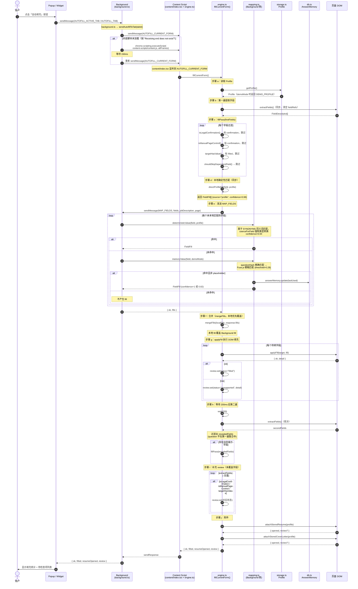

# 自动填充业务链路（AS-IS）

本文档描述从用户触发自动填充到表单填充完成的完整流程。所有引用的文件路径与函数名均对应仓库当前实现。

## 触发入口

| 入口 | 文件 | 消息类型 |
| --- | --- | --- |
| Popup「自动填充当前页面」按钮 | `entrypoints/popup/main.tsx` → `autofill()` | `AUTOFILL_ACTIVE_TAB` |
| Widget「自动填充此页面」按钮 | `entrypoints/content/Widget.tsx` → `AutofillTab` → `run()` | `AUTOFILL_TAB` |

两条路径的区别仅在于 Background 如何定位目标 tab：
- `AUTOFILL_ACTIVE_TAB`：`background.ts` 通过 `chrome.tabs.query({ active: true, currentWindow: true })` 取当前激活 tab。
- `AUTOFILL_TAB`：`background.ts` 直接使用 `sender.tab.id`（消息来自 Widget 所在的内容脚本）。

## 完整流程（Mermaid 时序图）

## 关键设计点

### 同步 / 异步边界

| 操作 | 文件 | 性质 |
| --- | --- | --- |
| `extractFields()` | `engine.ts` | **同步**（直接遍历 DOM，写入模块级 `fieldRefs` Map） |
| `directProfileFill()` | `engine.ts` | **同步**（基于 `directProfileValue` 的 `hasAny` 关键词匹配） |
| `getProfile()` | `storage.ts` | **异步**（`chrome.storage.local.get`） |
| `chrome.runtime.sendMessage(MAP_FIELDS)` | 跨上下文 | **异步**（Background 内 `deterministicValue` 同步、`memoryValue` 异步） |
| `applyFill()` | `fillers.ts` | **异步**（返回 Promise，但内部 DOM 操作本身同步，异步主要为了统一签名与 future-proof） |
| `wait(200)` | `engine.ts` | **异步**（`window.setTimeout` 包裹的 Promise） |
| `attachStoredResume / attachStoredCoverLetter` | `engine.ts` | **异步**（可能需要 `openUploadAndFindInput` 轮询 20×50ms 等待弹窗 file input） |

### Source of Truth

| 数据 | 存储 | 读取入口 |
| --- | --- | --- |
| Profile（身份/授权/默认值/人口统计等） | `chrome.storage.local["profile"]`（`lib/storage.ts`） | `getProfile()`；Demo Mode 返回 `DEMO_PROFILE`（`lib/demo.ts`） |
| AnswerMemory（历史问答） | Dexie `answerMemory` 表（`lib/db.ts`） | `memoryValue()` 通过 `questionHash` 精确匹配 + `Fuse.js` 模糊匹配 |

注意：`engine.ts` 内的 `directProfileFill` 与 `mapping.ts` 内的 `deterministicValue` 是**两套独立的本地匹配逻辑**：
- `directProfileFill`（content script 侧）：基于 `domSignal`（id/name/autocomplete/aria-label/祖先 4 层）+ question 文本的 `hasAny` 关键词匹配，confidence=0.98，**不会**经过 `coerceForField` 选项强制转换。
- `deterministicValue`（background 侧）：基于 `SYNONYMS` 同义词表（`lib/synonyms.ts`）规范化匹配，confidence=0.94，会经过 `coerceForField`（select/checkbox/boolean 选项适配）。

`mergeFills` 中 content script 的本地 fill 作为 `primary` 覆盖 Background 返回的 `secondary`（相同 `id` 时 primary 胜出）。

### 失败路径

1. **内容脚本未加载**：`sendMessageToTabWithInjection`（`background.ts`）捕获 `"Receiving end does not exist"`，通过 `chrome.scripting.executeScript({ target: { tabId, allFrames: true }, files: ["content-scripts/content.js"] })` 注入，等待 150ms 后重发。
2. **MAP_FIELDS 失败**：`fillPass` 中 `if (!response?.ok) throw new Error(response?.error ?? "Mapping failed.")`，错误冒泡到 content script 的 `fillCurrentForm().catch`，返回 `{ ok: false, error }`。
3. **字段类型不匹配 / DOM 不可交互**：`applyFill`（`lib/fillers.ts`）对以下情况返回 `{ ok: false, detail }`，review 标记为 `unsupported`：
   - radio 组（`Array.isArray(target)`）→ "Choose this radio option manually."
   - hyperlink 触发器（`isHyperlinkTrigger`）→ "Add this hyperlink manually."
   - combobox（`role="combobox"`）→ "Choose this dropdown option manually."
   - select 选项缺失 → `Option "X" is unavailable.`
   - checkbox 收到非 boolean 值 → "Checkbox requires an explicit true or false preference."
   - file / password 控件 → "This control requires direct user action."
   - 非 input/textarea/select 元素 → "Unsupported page control."
   - setNativeValue 后值未保留 → "Input did not retain the value."
4. **缺失字段**：`fieldsToMap` 中无对应 fill 的字段标记为 `missing`（"Add this answer to the master profile."）。
5. **附件失败**：
   - `attachStoredResume`：未存储 resume → 点击触发器，标 `confirmation`；找不到 file input → `unsupported`；`input.files[0].name` 不匹配 → `unsupported`。
   - `attachStoredCoverLetter`：未存储 → `unsupported`（"No cover letter upload control was detected."）。

### 幂等性

`fillCurrentForm` 可安全多次调用：
- `extractFields()` 每次调用先 `fieldRefs.clear()`，重新建立引用，不残留旧状态。
- `fillPass` 过滤阶段 `targetHasValue(target)`（`engine.ts`）会检测已填充控件：
  - `HTMLSelectElement`：`value` 非空且 `selectedIndex > 0`
  - `HTMLInputElement`（非 checkbox/radio）：`value.trim()` 非空
  - `HTMLTextAreaElement`：`value.trim()` 非空
  - SuccessFactors hyperlink：关联 `input[type=hidden]` 值非空
  - 命中后标 `filled`（"Already complete."）并跳过填充。
- checkbox/radio 不参与 `targetHasValue`（返回 false），但 `applyFill` 对 checkbox 会校验 `target.checked === fill.value`。
- `loggedSubmissionKeys`（用于申请跟踪，见 `application-tracking.md`）是模块级 Set，跨多次调用累积去重，不影响填充本身。

### 字段提取范围（extractFields）

- 选择器：`input, textarea, select`，过滤 `isVisible`（宽高 > 0）且非 `isSearchOrNav`（name/placeholder 含 search/filter）。
- 排除 input type：`hidden, password, button, submit, reset, image`。
- radio 同名组合并为一项（取第一个可见 radio，记录所有可见兄弟的 label）。
- 额外采集：SuccessFactors `[role=button].rcmHyperlinkIconAdd` 触发器（type=`hyperlink`）、含 `terms of use|privacy statement` 的按钮（type=`confirmation`）。
- `field.question` 为空的字段被丢弃。

### 两遍填充的意义

第一遍后等待 200ms 再 `extractFields`， diff 出 `question` 不在第一遍集合中的 `revealedFields`（典型场景：选择某 radio 后级联出新的必填项）。仅当存在揭示字段时才执行第二遍 `fillPass`。最后再全量扫一次为遗漏字段补 review 状态。

### 附件填充机制

`attachStoredResume` / `attachStoredCoverLetter` 通过 `DataTransfer` 将 `profile.resumeFile.dataUrl`（base64）还原为 `File`，赋值给 `input.files` 并派发 `input` + `change` 事件。若触发器不是直接的 `<input type=file>`，先 `click()` 打开上传弹窗，再用 `openUploadAndFindInput` 轮询（最多 20 次 × 50ms）寻找匹配的 file input。

## 相关文件

- `entrypoints/popup/main.tsx`：Popup 自动填充按钮
- `entrypoints/content/Widget.tsx`：Widget `AutofillTab` 组件
- `entrypoints/content/index.tsx`：content script 消息路由（`AUTOFILL_CURRENT_FORM` → `fillCurrentForm()`）
- `entrypoints/background.ts`：`sendAutofillToTab`、`sendMessageToTabWithInjection`、`MAP_FIELDS` 处理
- `entrypoints/content/engine.ts`：`fillCurrentForm`、`fillPass`、`extractFields`、`directProfileFill`、`mergeFills`、`attachStoredResume`、`attachStoredCoverLetter`
- `lib/mapping.ts`：`deterministicValue`、`memoryValue`、`rememberAnswer`、`questionHash`
- `lib/fillers.ts`：`applyFill`、`setNativeValue`
- `lib/storage.ts`：`getProfile`
- `lib/db.ts`：Dexie `answerMemory` 表
- `lib/synonyms.ts`：`SYNONYMS` 同义词表
- `lib/schema.ts`：`FieldDescriptor`、`FieldFill`、`AutofillReviewItem`、`ExtensionMessage` 类型定义
