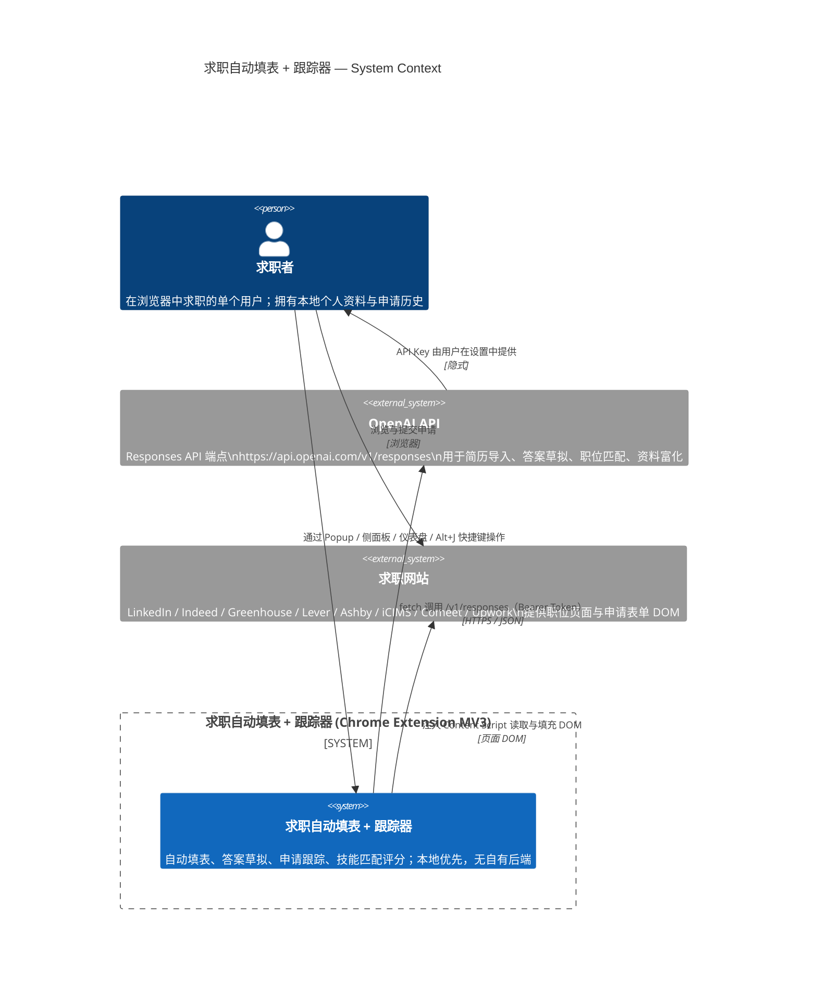

# 系统上下文（System Context）

> 状态：**AS-IS**（反映当前代码实际行为，基于 `wxt.config.ts`、`entrypoints/`、`lib/` 的实际实现）
>
> 这是 C4 模型的第 1 层（Context），描述系统对外呈现的整体形态、使用者与外部依赖。运行单元细节见 [containers.md](containers.md)，Content Script 内部细节见 [components/content-script.md](components/content-script.md)。

## 1. 系统概述

**求职自动填表 + 跟踪器**（Manifest 名称：`求职自动填表 + 跟踪器`，版本 `0.1.0`）是一个基于 **Chrome Extension Manifest V3** 的浏览器扩展，使用 [WXT](https://wxt.dev) 框架构建。它帮助求职者在浏览器内完成求职申请的端到端流程：

1. **自动填写申请表单**——从本地个人资料（Profile）自动填充求职申请页面的字段，采用三层优先级（确定性 Profile 匹配 → 记忆答案模糊匹配 → AI 兜底）。
2. **草拟筛选问题答案**——通过 OpenAI 根据个人资料草拟开放性问题答案，可复制到申请页或保存到答案库供复用。
3. **跟踪申请进度**——以看板（Kanban）和列表视图管理申请管道，支持状态流转、跟进到期提醒、Upwork 提案状态机、CSV 导出。
4. **技能匹配评分**——在 LinkedIn / Indeed 搜索页面的职位卡片上注入匹配分数徽章，并在侧面板展示本地词库匹配与 AI 深度分析。

## 2. 使用者（Actors）

| 使用者 | 描述 | 与系统的交互方式 |
|--------|------|------------------|
| **求职者（Job Seeker）** | 唯一的人类使用者，扩展的唯一服务对象 | 通过浏览器在求职网站浏览/提交申请；通过扩展图标（Popup）、侧面板（Widget）、仪表盘（Options）操作；快捷键 `Alt+J` 切换 Widget |

本系统是**单用户、本地优先**的扩展：所有个人资料、申请记录、答案库均存储在用户本机的浏览器存储中（IndexedDB + `chrome.storage.local`），不经过任何自有后端服务器。

## 3. 外部系统（External Systems）

| 外部系统 | 角色 | 交互方式 | 认证 |
|----------|------|----------|------|
| **OpenAI API** | 提供 AI 能力：简历导入、筛选答案草拟、职位匹配分析、个人资料富化、职位信息提取 | 扩展通过 `fetch` 直接调用 `https://api.openai.com/v1/responses`（Responses API，JSON Schema 严格模式）；调用入口集中在 `lib/ai.ts` | Bearer Token，API Key 由用户在设置中提供，存储于 `chrome.storage.local` 的 `settings.apiKey` |
| **求职网站** | 申请表单宿主与职位信息来源 | Content Script 注入到这些网站的页面 DOM 中，提取字段、填充表单、监听提交、识别公司/职位/来源 | 无（公开页面，用户已登录的页面状态由浏览器持有） |

### 3.1 支持的求职网站

依据 `entrypoints/content/engine.ts` 的 `isAllowedJobPage()` 与 `detectSource()`，扩展识别以下站点（AS-IS）：

- **ATS 申请平台**：Greenhouse（`greenhouse.io`）、Lever（`lever.co`）、Ashby（`ashbyhq.com`）、iCIMS（`icims.com`）、Comeet（`comeet.co`）
- **综合求职平台**：LinkedIn（`linkedin.com`）、Indeed（`indeed.com`）
- **自由职业平台**：Upwork（`upwork.com`）——额外提供提案状态机与 Connects 统计
- **通用兜底**：任何包含申请表面征（`hasApplicationSurface()`：检测到 "submit application"、"upload your resume" 等短语且可见字段 ≥ 3）的页面

`hcaptcha.com` 被显式排除。

## 4. C4 Context Diagram

## 5. 关键边界与约束

以下约束来自 [AGENTS.md](../AGENTS.md) 的 Global Invariants，对系统上下文层面的理解至关重要：

1. **本地优先**：所有用户数据存于本机浏览器（IndexedDB `jobAutofillTracker` + `chrome.storage.local`），无自有后端、无云同步。跨设备不同步。
2. **Background 是 AI 调用入口（针对 Content Script / Popup）**：Content Script 与 Popup 不直接 `fetch` OpenAI，而是通过 `chrome.runtime.sendMessage` 路由到 Background。原因：API Key 存储隔离 + 统一错误处理。
   - **AS-IS 注记**：Options 仪表盘为提供完整的编辑体验，直接 `import` 并调用 `lib/ai.ts` 中的函数（如 `importProfileFromCv`、`draftApplicationFromJobPosting`、`enrichProfileFromText`、`draftSingleAnswer`），未走消息路由。这与"Background 是唯一 AI 入口"的约束存在偏差，详见 [containers.md](containers.md)。
3. **演示模式（Demo Mode）全局短路**：`settings.demoMode === true` 时，所有写操作被跳过，`getProfile()` 返回 `DEMO_PROFILE`。
4. **法律确认字段永不自动填充**：`isLegalConfirmation()` 检测到的条款确认字段仅标记为 `confirmation`，留给用户手动操作。
5. **Manifest 权限**（`wxt.config.ts`）：`storage`、`unlimitedStorage`、`activeTab`、`downloads`、`scripting`、`alarms`；`host_permissions` 覆盖 `https://*/*`、`http://*/*`、`https://api.openai.com/*`。

## 6. 相关文档

| 主题 | 文档 |
|------|------|
| 运行单元与边界（Service Worker / Content Script / Popup / Options / 存储） | [containers.md](containers.md) |
| Content Script 内部组件（engine / Widget / Tabs / cardBadges） | [components/content-script.md](components/content-script.md) |
| 自动填充链路 | [flows/autofill.md](flows/autofill.md) |
| 申请跟踪链路 | [flows/application-tracking.md](flows/application-tracking.md) |
| AI 集成 | `lib/ai.ts`（AGENTS.md 提及 `flows/ai-integration.md`，当前仓库未提供该文件） |
| 消息协议 | [contracts/message-protocol.md](contracts/message-protocol.md) |
| 数据模型 | [contracts/data-model.md](contracts/data-model.md) + `lib/schema.ts` |
| 术语表 | [glossary.md](glossary.md) |
